This weekend, I decided to create a clone of my hard drive.  I've been using it for a while, and since all hard drives fail eventually, I decided to swap it out before it fails rather than after.

I decided to use this method because it creates a seamless experience from before to after the upgrade. I wouldn't have to reinstall my old apps or copy files back over.  

I chose Clonezilla because it's the industry standard for free cloning software.

First, I installed [Ventoy](https://www.ventoy.net/en/index.html) which allowed me to have multiple live ISOs available without having to purchase multiple thumb drives for each one.  Each time I wanted to use a new ISO, I would simply drag it to the thumb drive where Ventoy is installed:

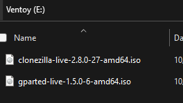

I booted from the Ventoy drive:

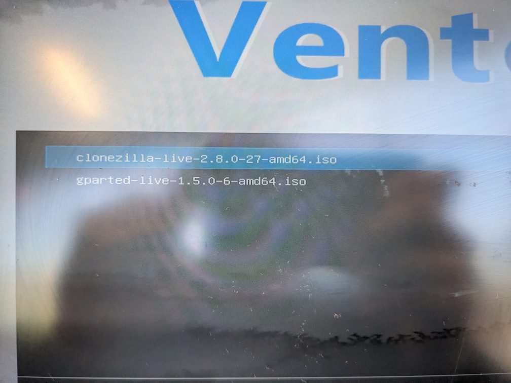

I selected Clonezilla and booted again.  Since this was my first time cloning with Clonezilla, a few of the screens were confusing to me.  I had to do some Googling to determine the correct action.

I selected disk-image mode, since I had to save my old hard drive as an image, then restore the image to a new hard drive that I purchased.

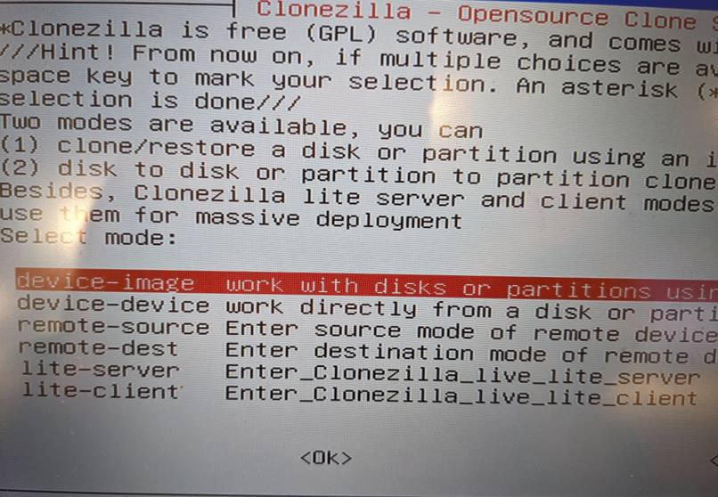

I had to select the type of wizard, so I selected Beginner Mode, since I am a beginner during this process.  

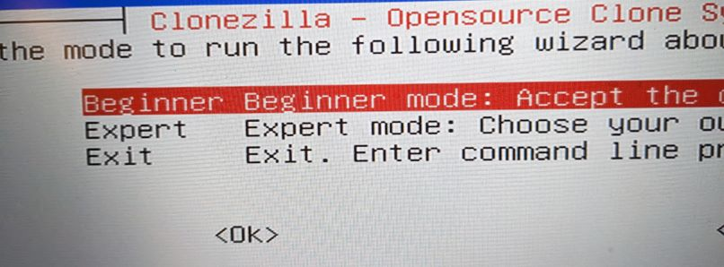

In this picture, I selected local-dev, since I saved the clone to my Westdern Digital Passport external hard drive:

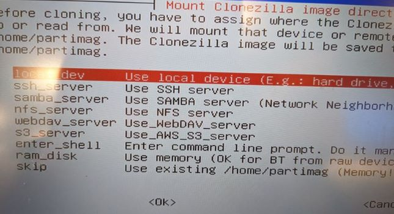

Then, I selected the folder on my external hard drive where I wanted to save the image:

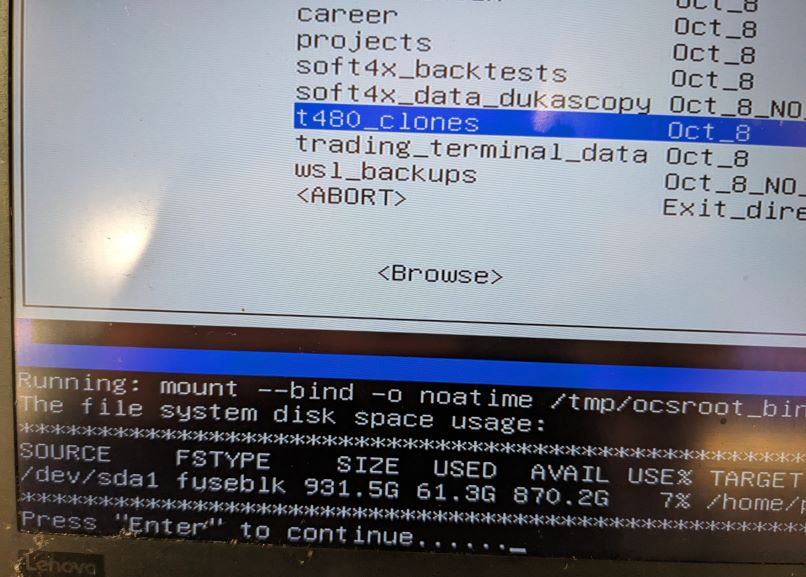

In this screen, you can see where I selected my old hard drive as the source of the image creation process:

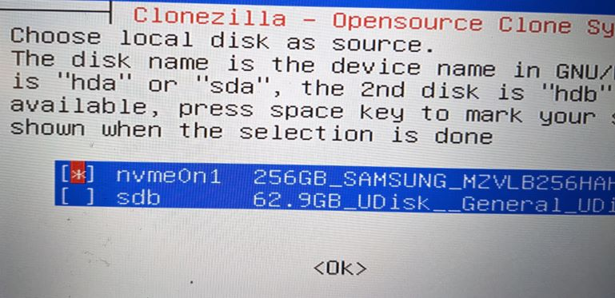

Then, I saved my hard drive as a clone image:

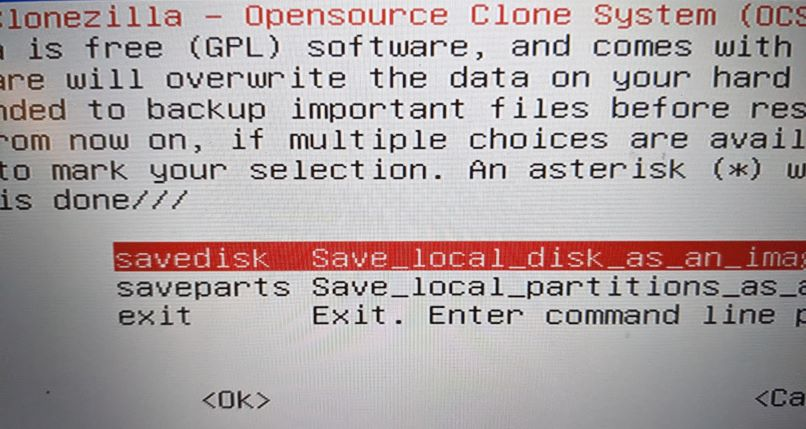

And again, with this confirmation screen:

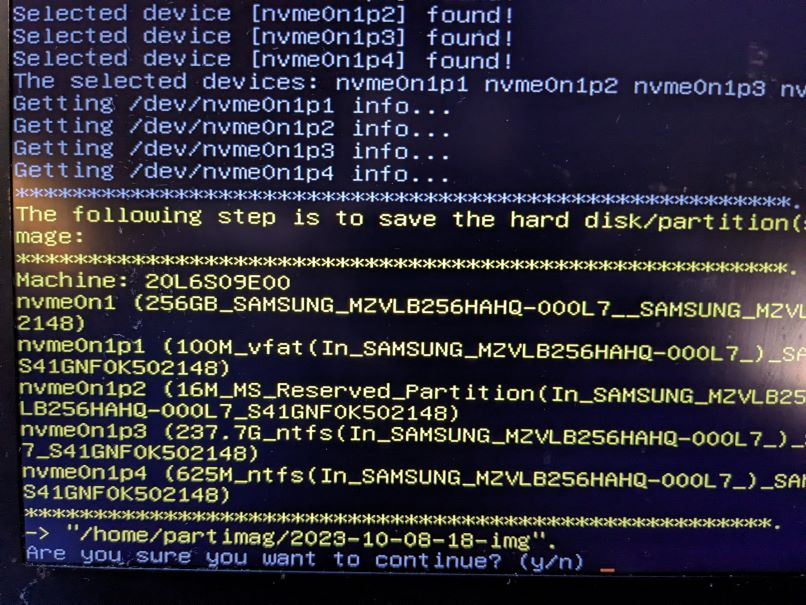

After the image was saved, I proceeded through the wizard in almost the same manner as before, but I restored from an image instead of saving it:

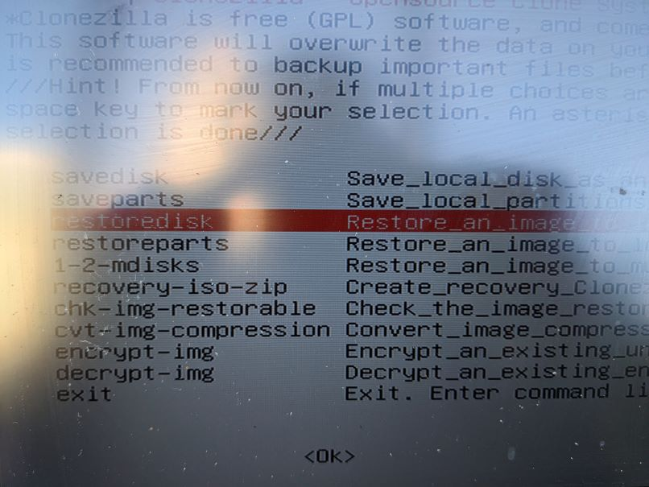

I mounted the image repository as before, selected the image I saved, then choose the destination drive.  It showed the new Crucial drive I purchased:

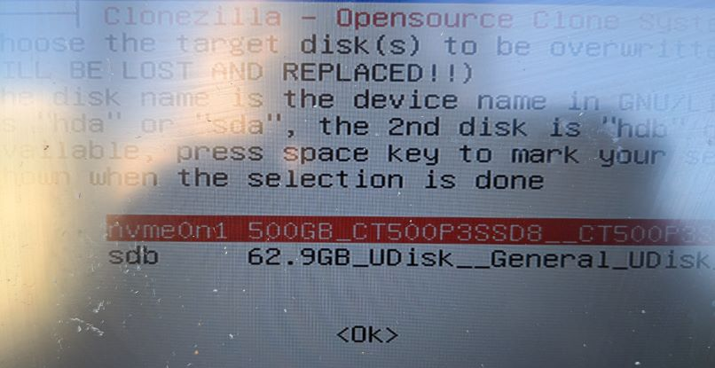

Then, I received this confirmation screen:

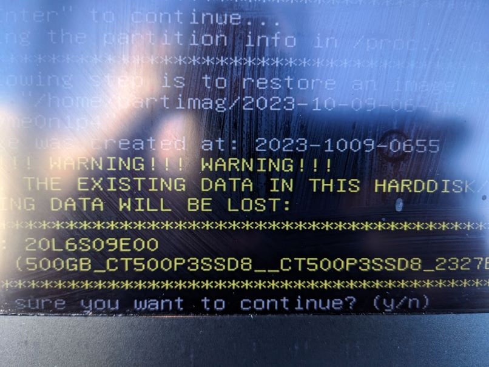

I let Clonezilla restore the image as I read a book on my Kindle.  After I was done, I logged into Windows and discovered a problem.  The C: drive was still showing a maximum size of 256GB, not 480GB.  This means I had made a mistake during the cloning process.  I suspected that there would be a large chunk of unallocated space in the partition table of the new drive.  I booted into GPARTED to confirm this:

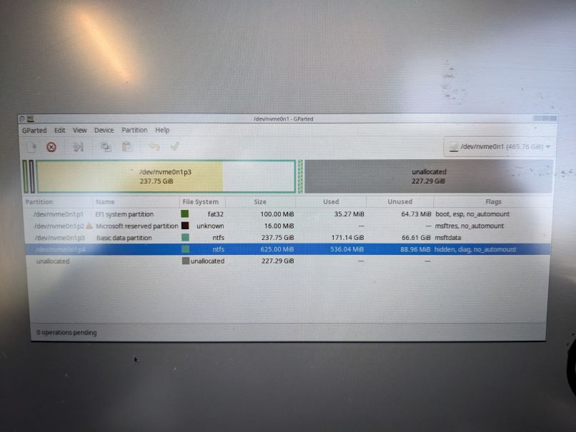

It was as I suspected.  The Microsoft data partition had not expanded correctly to reflect the larger size of the new hard drive I purchased.  Even more concerning, there was a smaller partition in between the data partition and the unallocated space, so I could not simply resize it.  First, I referenced an image from Microsoft's [guide](https://learn.microsoft.com/en-us/windows-hardware/manufacture/desktop/configure-uefigpt-based-hard-drive-partitions?view=windows-11) on UEFI/GPT-based hard drive partitions: 

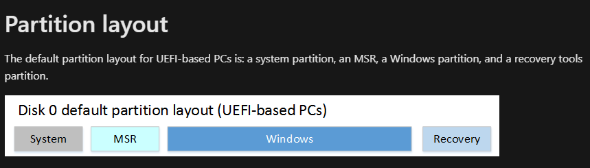

I suspected the partition which was preventing my resizing effort was the Recovery drive.  I didn't want to delete it, but could I move it?  I found out that I could move it all the way to the right of the table:

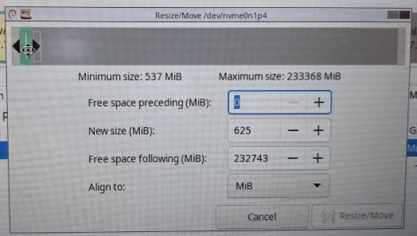

After I moved it, the partition table looked like this:

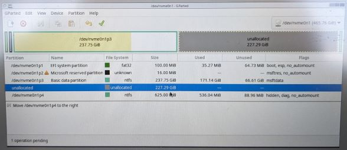

I could now expand the Data partition, and the resulting partition table looked like this:

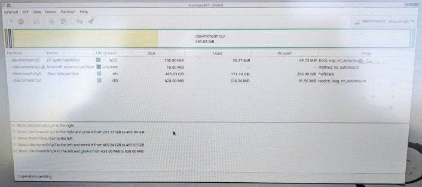

I finalized the changes, booted back into Windows, and found that everything was OK in Windows Explorer:

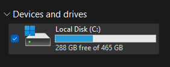

